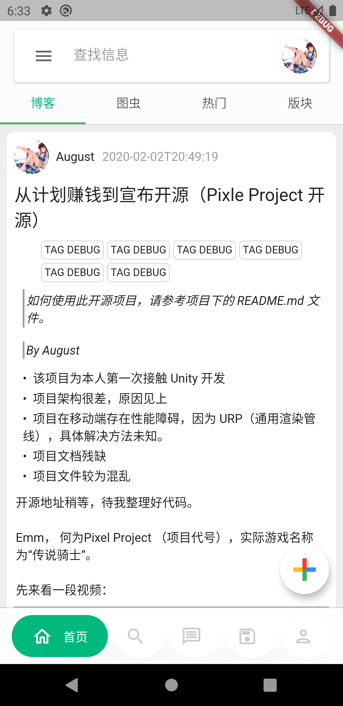
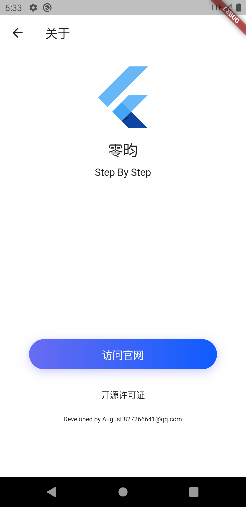

# social_project

#### 代码较烂，等重构

一款基于 Wordpress 的 内容浏览 APP

Social project.

使用 Wordpress REST API 作为后端驱动， Flutter 作为前端开发。

**本程序附带的 _shared 库, 正着手进行开源计划, 目前项目为半开源**

## TODO  

### 欢迎提交功能请求  

- [x] 搜索
- [x] Wordpress 登录
- [x] 发表纯文本文章
- [x] 发表带有头图的纯文本文章
- [ ] 发送附带任意多媒体的文章
- [ ] 多账号
- [ ] 推送通知
- [ ] 收藏文章
- [ ] 用户私聊
- [ ] 屏蔽文章

## 艺术交流地带
包括但不限于 音乐、绘画、游戏、文章、影视、code

